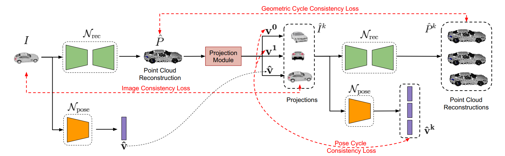

# Self-supervised 3D Point Cloud Reconstruction
Source code for the [paper](https://arxiv.org/abs/2005.01939) "From Image Collections to Point Clouds with Self-supervised Shape and Pose Networks".</br>
Accepted at *IEEE Conference on Computer Vision and Pattern Recognition (CVPR-20)*

## Overview
The approach aims to reconstruct 3D point clouds from a single 2D view of the object using just image and silhouette collection as supervision. A single image (and mask) are used per 3D model during training. To avoid degenerate solutions, we propose the novel geometric and pose cycle consistency losses. Along with nearest neighbour consistency loss, these help in obtaining effective 3D reconstructions similar to those obtained using higher degree of supervision. 


## Usage

Install [TensorFlow](https://www.tensorflow.org/install/). We recommend installing version 1.3 so that the additional TensorFlow ops can be compiled. <br>
```shell
# Clone the repository:
git clone https://github.com/klnavaneet/ssl_3d_recon.git
cd ssl_3d_recon
```
You need to compile the tensorflow ops to calculate Chamfer and EMD metrics and to visualize point clouds. Run the makefile to compile. Change the paths for nvcc, cudalib and tensorflow appropriately in the makefile. <br>
```shell
# Compile tensorflow ops:
make
```

## Dataset
We use the ShapeNet dataset in our experiments. We use the <a href="https://github.com/shubhtuls/drc/blob/master/docs/snet.md#rendering" target="_blank" >code</a> provided by Tulsiani et al. to obtain the rendered images and part segmentation maps. Download links for the ShapeNet point cloud dataset is provided below: <br>
ShapeNet pointclouds (~2.8 GB): https://drive.google.com/open?id=1cfoe521iTgcB_7-g_98GYAqO553W8Y0g <br>

Download the the folder, extract and move it into *data/*. The directory for point clouds is *data/ShapeNet_v1/*. Save the rendered images in *data/ShapeNet_rendered/*. Then run the code to create tfrecords files using appropriate changes in the code (set each of image, mask, pose and pcl to True as documented in the code).<br>
```shell
cd src/utils
# Create tfrecords file for OURS-CC model
python create_tf_records.py
# Create tfrecords file for OURS-NN model
python create_tf_records_knn.py
# Verify the created tfrecords file
python read_tf_records.py
```

### Training

#### Geometric and Pose Consistency Loss only (OURS-CC Model)
Train the model using geometric and pose consistency losses. Nearest neighbour loss is not included. This corresponds to the OURS-CC model refered to in the paper. Adjust the hyperparameters as necessary. The default parameters used for the first stage of training are provided in the bash script.
```shell
bash run.sh
```

#### Complete model training (OURS-NN Model)
Train the model using all losses - geometric and pose consistency and nearest neighbour loss. This corresponds to the OURS-NN model referred to in the paper. Adjust the hyperparameters as necessary. We have provided the file to automatically load the nearest neighbour images. You can also use custom neighbours by training the OURS-CC model first to obtain the nearest neighbours or by manually defining the neighbours. The default hyperparameters used for the first stage of training are provided in the bash script.
```shell
bash multiple_mask_run.sh
```

### Evaluation

You first need to save the point cloud outputs. Since the orientation of the predicted point clouds can be different from the canonical orientation of the ground truth point clouds, the predictions need to be aligned with the ground truth. Make appropriate changes in the codes to ensure correct experiment directories are used in saving and aligning point clouds. 
```shell
cd src/evaluation
# Save output point clouds
bash save_pcl.sh
# Align point clouds with ground truth
python align_pcl_transform.py
```

You can then calculate the metrics or visualize the point cloud outputs.
```shell
cd src/evaluation
# Calculate loss and visualize 3D outputs
bash pcl_loss_saved.sh
python visualize_pcl_3d.py
```

## Citation
If you make use of the code, please cite the following work:
```
@inproceedings{navaneet2020ssl3drecon,
 author = {Navaneet, K L and Mathew, Ansu and Kashyap, Shashank and Hung, Wei-Chih and Jampani, Varun and Babu, R Venkatesh},
 booktitle = {IEEE Conference on Computer Vision and Pattern Recognition (CVPR)},
 title = {From Image Collections to Point Clouds with Self-supervised Shape and Pose Networks},
 year = {2020}
}
```
